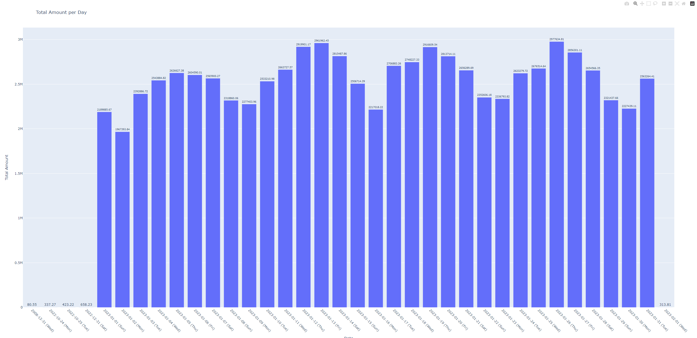

# Project Overview
This project is a data pipeline for analyzing and visualizing taxi trip data. It consists of two main components: data loading into a SQL Server database and aggregation/visualization of total trip amounts per day. The project uses Python scripts and leverages libraries such as pandas, pyodbc, and Plotly Express.

# Setup Instructions
1. Clone the Repository:
```
git clone https://github.com/<username>/your_project.git
cd your_project
```
2. Install Dependencies:
```
pip install -r requirements.txt
```
3. Create Configuration File: <br>
Create a config.json file with the necessary configuration parameters. See the provided config_example.json for reference.
4. Prepare Data: <br>
Place your Parquet file containing taxi trip data in the project directory.

# Execution Instructions
1. Load Data into Database: <br>
Run the load_data.py script through command line or manually execute the script to load data from the Parquet file into the SQL Server database.
```
python load_data.py
```
2. Aggregate and Visualize Data: <br>
Run the visualize_data.py script through command line or manually execute the script to aggregate total trip amounts per day and generate a visualization.
```
python visualize_data.py
```

# Discussion
During the development of the data processing and visualization scripts, I encountered several challenges:

Parallelism Constraints:

I explored parallel processing techniques to improve performance but faced limitations due to constraints with the database management system (DBMS) and Python libraries.
The inability to establish multiple simultaneous connections to the SQL Server database using pyodbc hindered the implementation of parallelism.
SQL Server's restrictions on the number of concurrent connections further limited the feasibility of parallel processing.

Visualization Challenges:

When initially using Matplotlib and Seaborn for visualization, I encountered issues with the display of total amount values, which appeared as 0.0, 0.5, 1.0, and so on, rather than the actual values.
These incorrect values were a result of data formatting or scaling issues, which were not resolved despite several attempts.
I addressed this issue by switching to Plotly Express, a library that provided accurate visualization of total amount values, including those in the millions.
These challenges prompted to focus on optimizing the data processing pipeline within a single thread and database connection. Despite the limitations with parallelism and initial visualization libraries, I was able to achieve satisfactory performance improvements and accurate visualizations using alternative approaches.

# Visualization Output


